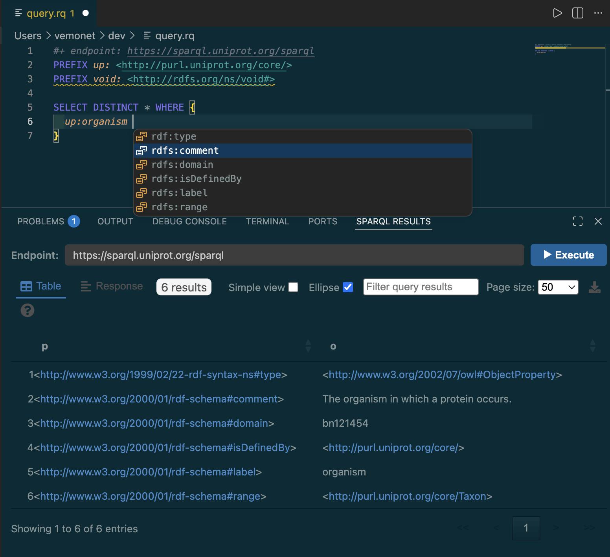

# 🫆 SPARQL Qlue

A VisualStudio Code extension for working with SPARQL query files (`.rq`, `.sparql`)

- Syntax highlighting
- Diagnostics, autocomplete, formatting using the [qlue-ls](https://github.com/IoannisNezis/Qlue-ls) language server running via WebAssembly
- Execute SPARQL query and inspect results with [YASGUI](https://github.com/rdfjs/Yasgui) YASR package

## Language Server (qlue-ls)

- **Context-aware autocomplete**: suggests subjects, predicates, and objects based on your SPARQL endpoint and the current query context
- **Hover information**: shows labels and descriptions for IRIs by querying the endpoint
- **Diagnostics**: reports syntax errors and warnings as you type
- **Auto-formatting**: formats SPARQL documents on demand or automatically on save with `sparql-qlue.formatOnSave` setting
- **Code actions**: quick fixes for common issues

## Query Execution

- Run the active query with **Ctrl+Enter** / **Cmd+Enter**, the **▶** toolbar button, or **right-click → Execute SPARQL Query**
- Results displayed in the **SPARQL Results** panel powered by [YASGUI](https://github.com/rdfjs/Yasgui)
- Endpoint resolved from a `#+ endpoint: <url>` comment in the file, or from an `endpoint.txt` file in the same directory or any parent up to the workspace root

## Language Server Settings

Click the **⚙** gear button in the SPARQL Results panel toolbar (or run **SPARQL Qlue: Configure Language Server** from the Command Palette) to open the settings editor.

Settings are grouped into three sections that mirror the qlue-ls TOML configuration:

### `[format]`

| Setting              | Default | Description                                                |
| -------------------- | ------- | ---------------------------------------------------------- |
| `alignPredicates`    | `true`  | Align triple predicates in a column                        |
| `alignPrefixes`      | `false` | Align PREFIX declarations in a column                      |
| `separatePrologue`   | `false` | Blank line between prologue and query body                 |
| `capitalizeKeywords` | `true`  | Uppercase SPARQL keywords (SELECT, WHERE, …)               |
| `insertSpaces`       | `true`  | Indent with spaces (off = tabs)                            |
| `tabSize`            | `2`     | Number of spaces per indentation level                     |
| `whereNewLine`       | `false` | Place WHERE clause on its own line                         |
| `filterSameLine`     | `true`  | Keep FILTER on the same line as its block                  |
| `lineLength`         | `120`   | Target line length for wrapping                            |
| `contractTriples`    | `false` | Use `;` notation to contract triples with the same subject |
| `keepEmptyLines`     | `false` | Preserve intentional blank lines from the original source  |

### `[completion]`

| Setting                          | Default | Description                                                        |
| -------------------------------- | ------- | ------------------------------------------------------------------ |
| `timeoutMs`                      | `5000`  | SPARQL query timeout for completion requests (ms)                  |
| `resultSizeLimit`                | `100`   | Maximum number of completion items returned                        |
| `subjectCompletionTriggerLength` | `3`     | Minimum typed characters before subject completion fires           |
| `objectCompletionSuffix`         | `true`  | Append trailing space/dot after inserting an object completion     |
| `variableCompletionLimit`        | `10`    | Maximum variable completion suggestions                            |
| `sameSubjectSemicolon`           | `true`  | Use `;` notation when completing predicates for a repeated subject |

### `[prefixes]`

| Setting        | Default | Description                                      |
| -------------- | ------- | ------------------------------------------------ |
| `addMissing`   | `true`  | Automatically insert missing PREFIX declarations |
| `removeUnused` | `false` | Remove PREFIX declarations not used in the query |

Settings are persisted to workspace configuration (`sparql-qlue.serverSettings`) and applied to the running language server immediately.

## Extension Settings

| Setting                    | Default | Description                                                           |
| -------------------------- | ------- | --------------------------------------------------------------------- |
| `sparql-qlue.formatOnSave` | `false` | Automatically format SPARQL documents via the language server on save |

## Contributing

See [CONTRIBUTING.md](CONTRIBUTING.md)
